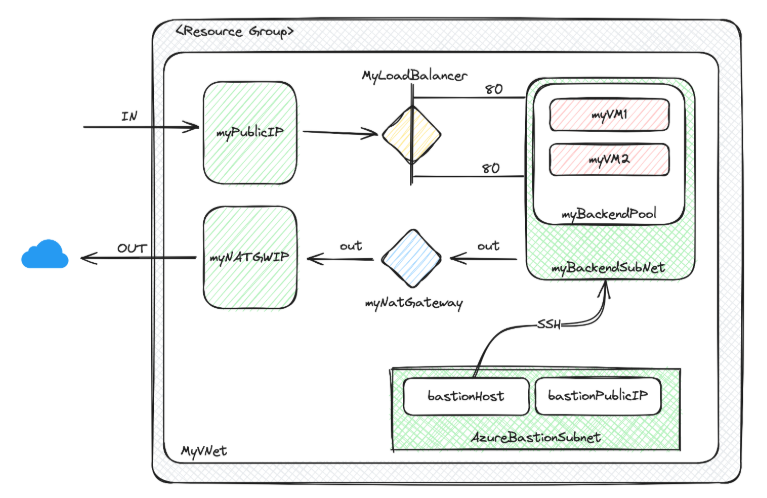
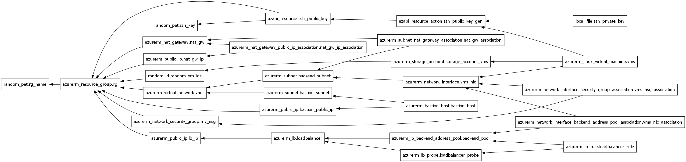

# Terraform_Azure_LoadBalancer

This project is designed to provision an Azure Load Balancer using Terraform. The goal is to automate the process of setting up a load balancer in Azure, making it faster and more efficient.

The following Infrastructure is being provisioned:

## Getting Started

To get started with this project, you'll need to have Terraform installed on your machine. You can download it from the [official Terraform website](https://www.terraform.io/downloads.html). You'll also need to have an Azure account and some way to authenticate, for example, Azure Powershell or Azure CLI.

## Usage

1. Clone this repository to your local machine.
2. Navigate to the directory containing the Terraform files.
3. Edit the `terraform.tfvars_template` file with your Azure Account info and rename the file to `terraform.tfvars`. For example, your file might look like this: `account_name = "your_account_name"`.
4. Run `terraform init` to initialize your Terraform workspace.
5. Run `terraform plan` to see the changes that Terraform will execute.
6. Run `terraform apply` to create the Azure Load Balancer Infrastructure if you're OK with the plan output.

## Documentation

This project is a class exercise, inspired by the example provided in the [Azure Load Balancer Quickstart documentation](https://learn.microsoft.com/en-us/azure/load-balancer/quickstart-load-balancer-standard-public-powershell).

The hierarchy of the Terraform resources is the following:

## License

This project is licensed under the MIT License - see the [LICENSE.md](LICENSE.md) file for details.